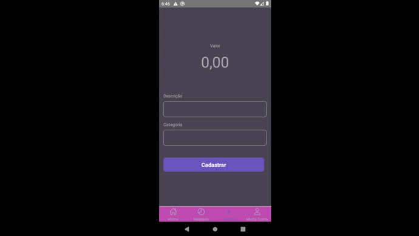

# SPIICE APP 


# Preview 


## Desafio 
Criar um app com componentes reutilizáveis para diversos nichos. Além de poder aplicar temas e configurações de designer system.

## Motivação 
Uma empresa pode ter vários aplicativos diferentes com objetivos e nichos específicos, e para cada aplicativo pode ser interessante ter uma identidade visual única mas sem perder a identidade da marca. 

A ideia é criar componente reutilizáveis não só para 1 app mas para uma quantidade infinita de apps mantendo a identidade visual da marca mas flexível o bastante para alterar cores, fonts, tamanhos e texto etc...

Nesse caso, tentei imaginar 2 apps. O primeiro é sobre finanças pessoais e logo me veio a cabeça as cores do Nu Bank. Então eu criei o tema purple. 

O segundo app é um dashboard com gráficos e listas. Para esse eu pensei nas cores do Excel, então criei o tema light.

## Solução
Para tornar isso real primeiro precisamos mapear todos os componentes e cria-los individualmente. 
Cada componente precisa enxergar propriedades do tema como cores, espaçamentos etc... 

Além disso o tema precisa está bem estruturado e aqui é importante definir bem os nomes das variáveis. 

```json
{
  "surface-color": "#000",
  "on-surface-color": "#fff"
}
```
Eu gosto de nomear as cores de forma genérica, assim nenhuma cor fica atrelada a um componente específico como por exemplo:

```json
{
  "border-color": "#000",
  "card-color": "#fff",
  "text-card-color": "#000"
}
```

Isso acaba deixando o tema mais complexo e mais verboso. E pode ser muito confuso na hora de configurar um novo tema além da possibilidade de quebrar esses valores.


## Redes 
<div> 
  <a href="https://www.youtube.com/channel/UC-0Zxkc_CuKPvb11nEhXjTg" target="_blank"></a>
  <a href="https://www.instagram.com/devraphaelcorrea/" target="_blank"></a>
 <a href = "mailto:raphael.correa.b@gmail.com"></a>
 <a href="https://www.linkedin.com/in/raphael-corr%C3%AAa-29993952/" target="_blank"></a> 
</div>
